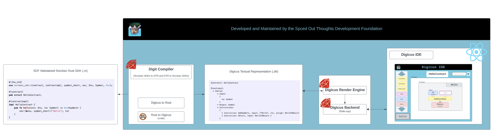

# Technical Architecture

## Digicus Programming Language

Heavily influenced by [Scratch](https://scratch.mit.edu/), Digicus is a net new, block-based, visual programming language consisting of a predefined set of *blocks* which users piece together to define Soroban smart contracts. 

### Overall Architecture



***

### Digit

The Digicus compiler (*digit*) provides a transcompilation from block-based contracts to and from the Rust SDK. It does so via the following pipelines (where `.dtr` stands for `digicus textural representation`):

1. **[To Contract]**: block-based contract --> `.dtr` file --> `.rs`
2. **[From Contract]**: `.rs` --> `.dtr` --> block-based contract

#### Digicus Textual Representation (.dtr) Format Specification

Each .dtr file contains the definition for a single contract. Each contract consists of:

* a contract name (CONTRACT_NAME)
* a set of functions (the interface)
* state, or data accessible to the contract

Thus, we have three main sections:

1. [Contract]: where the name of the contract is specified
2. [State]: where we define the type and initial data for each variable
3. [Function]: where we define each method (name, input, output, body)

If the `State` or `Function` section is omitted, it will be assumed to be non-existent.

**Overall structure**:
```
[Contract]: CONTRACT_NAME

[State]:
  * STATE_DEFINITION
  * STATE_DEFINITION
  ...
  * STATE_DEFINITION

[Functions]:
  * FUNCTION_DEFINITION
  * FUNCTION_DEFINITION
  ...
  * FUNCTION_DEFINITION
```

**STATE_DEFINITION**:
```
  [STATE_NAME]:
    * Type: TYPE_NAME
    * Initial Value: VALUE
```

Where TYPE_NAME can be any valid Rust (Soroban subset) type. (TBD) do we want a 1-to-1 mapping of Rust types to .dtr types? Yes for MVP, but maybe as we implement this it will be (a) easier to generalize and/or (b) clear that new users need not care about this and so we can make *smart* decisions for them.

**FUNCTION_DEFINITION**:
```
  [FUNCTION_NAME]:
    * Input:
      {
        INPUT_NAME: TYPE_NAME,
        ...
        INPUT_NAME: TYPE_NAME
      }
    * Output:
    * Instructions:
      {
        { instruction: INSTRUCTION_NAME, input: (VALUE_NAME: VALUE,..., VALUE_NAME: VALUE), assign: ASSIGN_NAME },
        ...
        { instruction: INSTRUCTION_NAME, input: (VALUE_NAME: VALUE,..., VALUE_NAME: VALUE), assign: ASSIGN_NAME }
      }
```

Note:
* the input section is optional
* the output section is optional
* output may be at most one value
* an instruct need not have an input not an output
* an ASSIGN_NAME is a local variable which may be referenced by following instructions
* INSTRUCTION_NAME is the name of a subset (TBD) of supported rust expressions

#### The Standard Library

We will provide standard library of instructions. Much of this will be determined from looking at:
* [contract examples](https://github.com/stellar/soroban-examples)
* [How to Build an SDK Docs](https://developers.stellar.org/docs/tools/sdks/build-your-own)
* [Rust SDK](https://github.com/stellar/rs-soroban-sdk/tree/main)
* [AssemblyScript SDK](https://github.com/Soneso/as-soroban-sdk)

***

## Digicus IDE

The Digicus IDE is the recommended text editor for creating and visualizing Soroban Visual block contracts. It is a React frontend with a Ruby on Rails backend. Visualization is achieved by transforming `.dtr` files into colorful, draggable, editable "Lego-like" blocks. Once contracts are loaded (or in the case of creation, initialized), the IDE presents a host of tools to aid in development:

1. drag and drop interface with real-time error detection on block compatibility
2. a pseudo language server which provides real time feedback on common mistakes, security vulnerabilitites, etc.
3. simulation
4. testing
5. auto-complete

***